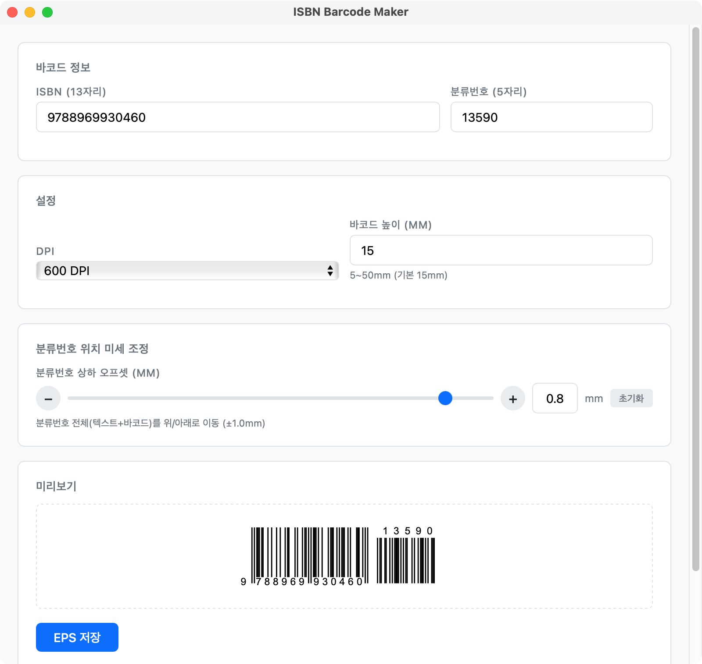

# ISBN Barcode Maker

ISBN-13 바코드와 EAN-5 분류번호를 EPS 벡터 파일로 생성하는 macOS 앱입니다.



## 기능

- ISBN-13 바코드 생성 (체크디짓 자동 검증)
- EAN-5 분류번호 (Add-on 5) 바코드 생성
- EPS 벡터 출력 (CMYK, 인쇄용)
- DPI 설정 (300 / 600 / 1200)
- 바코드 높이 mm 단위 설정 (5~50mm)
- 분류번호 위치 미세 조정 (±1.0mm)
- 실시간 미리보기
- 파일명: `isbn_{ISBN번호}_{분류번호}.eps`

## 기술 스택

- [Tauri v2](https://v2.tauri.app/) (Rust + WebView)
- React 18 + TypeScript
- Vite 6

## 요구사항

- macOS
- Node.js >= 25.5.0
- npm >= 11.8.0
- Rust >= 1.89.0

## 개발 셋업

```bash
# 저장소 클론
git clone https://github.com/totuworld/isbn-barcode-maker.git
cd isbn-barcode-maker

# npm 의존성 설치
npm install

# 개발 모드 실행
npm run tauri dev

# 프로덕션 빌드 (.app 생성)
npm run tauri build -- --bundles app
```

빌드된 앱은 `src-tauri/target/release/bundle/macos/ISBN Barcode Maker.app` 에 생성됩니다.
